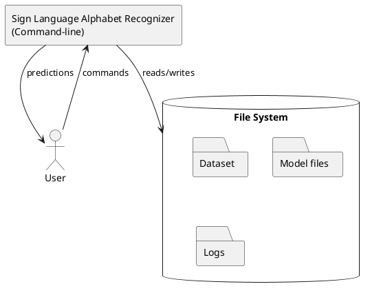
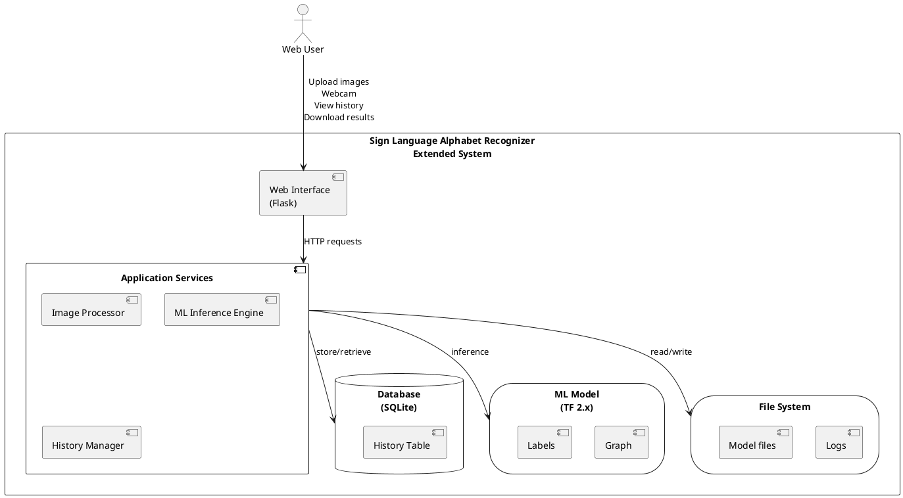

# Phase 3: Extending the Architecture of an ML-based System

**Title:** Sign Language Alphabet Recognizer - Architecture Extension

**Group No. 4:** Fayaz Shaik, Harsha Koritala, Mallikarjun Kotha, Sai Grishyanth Magunta, Sai Kiran Dasari

---

## Section 1: Identification of Architecture Drivers

### Task 1.1: New Use Cases

#### UML Use Case Diagram


#### New Use Cases Description Table

| Use Case ID | Use Case Name | Description | Actor | Priority |
|-------------|---------------|-------------|-------|----------|
| **UC4** | **View Prediction History** | Allow users to view their past predictions with timestamps and confidence scores in a simple table format | User | High |
| **UC7** | **Download Results** | Allow users to download the current prediction result as a text file | User | Medium |

#### Detailed New Use Case Specifications

**Use Case UC4: View Prediction History**
- **Actor:** User
- **Precondition:** User has previously made predictions using the system
- **Main Flow:**
  1. User clicks "History" button on the web interface
  2. System displays a simple table with past predictions
  3. Table shows: timestamp, predicted letter, confidence score
  4. User can view up to last 20 predictions
- **Postcondition:** User views their prediction history
- **Alternative Flow:** If no history exists, system displays "No predictions yet" message

**Use Case UC7: Download Results**
- **Actor:** User
- **Precondition:** User has just received a prediction result
- **Main Flow:**
  1. User views prediction result on screen
  2. User clicks "Download" button
  3. System generates a simple text file with prediction details
  4. File contains: predicted letter, confidence score, timestamp
  5. Browser downloads the file to user's computer
- **Postcondition:** User has a local copy of the prediction result

---

### Task 1.2: Quality Attributes (QAs)

#### Quality Attributes Table with Scenarios

| QA ID | Quality Attribute | Scenario | Associated Use Cases | Priority |
|-------|-------------------|----------|---------------------|----------|
| **QA1** | **Performance** | **Stimulus:** User uploads an image for classification<br>**Source:** Web interface<br>**Environment:** Normal operation<br>**Artifact:** Classification service<br>**Response:** System returns prediction<br>**Response Measure:** Response time < 2 seconds | UC1, UC3 | High |
| **QA2** | **Scalability** | **Stimulus:** 10 concurrent users access the system<br>**Source:** Multiple web clients<br>**Environment:** Peak usage hours<br>**Artifact:** Web server and ML inference engine<br>**Response:** System handles all requests<br>**Response Measure:** Support 10 concurrent users with < 3 second response time | UC1, UC2, UC3 | Medium |
| **QA3** | **Availability/Reliability** | **Stimulus:** ML model service crashes<br>**Source:** Internal component failure<br>**Environment:** Normal operation<br>**Artifact:** Classification service<br>**Response:** System returns user-friendly error message<br>**Response Measure:** System logs error and attempts auto-restart. Uptime > 99% | All UC | High |
| **QA4** | **Modifiability** | **Stimulus:** Need to add new sign language gestures<br>**Source:** Developer<br>**Environment:** Development time<br>**Artifact:** ML model and dataset<br>**Response:** System allows retraining with new classes<br>**Response Measure:** Adding 10 new classes requires < 4 hours | UC5 | Medium |
| **QA5** | **Security** | **Stimulus:** User uploads a malicious file<br>**Source:** User<br>**Environment:** Normal operation<br>**Artifact:** File upload handler<br>**Response:** System validates and rejects non-image files<br>**Response Measure:** 100% of non-image files rejected with error message | UC3 | High |

---

### Task 1.3: Constraints

#### Architecture Constraints Table

| Constraint ID | Type | Description | Impact |
|---------------|------|-------------|--------|
| **C1** | Technical | System must use Python 3.8+ and TensorFlow 2.x | Limits ML frameworks and requires code migration |
| **C2** | Technical | Web interface must be browser-based (no installation required) | Requires web framework, limits offline functionality |
| **C3** | Hardware | System must run on standard hardware (no GPU required) | Model must be CPU-optimized, may limit complexity |
| **C4** | Business | Solution must use open-source libraries | Limits choice to free tools (TensorFlow, Flask, OpenCV) |

---

### Task 1.4: Concerns

#### Architectural Concerns Table

| Concern ID | Concern | Description | Affected Stakeholders |
|------------|---------|-------------|----------------------|
| **CON1** | Model Accuracy | Current model has low accuracy (50 training steps), affecting user trust | Users, Developers, Administrators |
| **CON2** | Data Privacy | User-uploaded images may contain sensitive information needing protection | Users, Administrators |
| **CON3** | System Maintainability | Codebase needs to support future extensions without major refactoring | Developers, Administrators |
| **CON4** | Error Handling | System needs graceful degradation when components fail | Users, Developers |

---

## Section 2: Update the Software Architecture

### Task 2.1: Architecture Patterns and Tactics for QA Drivers

#### Solutions Table

| Driver ID | Architecture Driver | Pattern/Tactic | Solution Description |
|-----------|-------------------|----------------|----------------------|
| **QA1** | Performance | Caching | Cache loaded ML model in memory to avoid repeated loading |
| **QA2** | Scalability | Stateless Design | Design web service to handle multiple concurrent requests without session state |
| **QA3** | Availability/Reliability | Exception Handling + Logging | Wrap ML inference in try-catch blocks, log errors, return user-friendly messages |
| **QA4** | Modifiability | Layered Architecture | Separate Presentation (Web UI), Business Logic (Inference), and Data layers |
| **QA5** | Security | Input Validation | Validate file types (jpg, png), check size limits (< 10MB), reject executables |
| **UC4** | View History | Database Storage | Store predictions in SQLite: timestamp, predicted_letter, confidence_score |
| **UC7** | Download Results | File Generation | Generate text file with prediction details, trigger browser download |
| **C1-C4** | Constraints | Technology Selection | Use Flask, TensorFlow 2.x, OpenCV, SQLite |
| **CON1-CON4** | Concerns | Modular Design + Error Handling | Use configuration files, graceful error handling, clear component separation |

---

### Task 2.2: Context Diagram Updates

#### Current Context Diagram (Phase 1)

**PlantUML Code:**


#### Updated Context Diagram (Phase 3)

**PlantUML Code:**


**Key Updates:**
1. Added **Web Interface (Flask)** for browser-based access
2. Added **Application Services Layer** separating web UI from ML model
3. Added **Database (SQLite)** for storing prediction history
4. Transitioned from command-line to web-based architecture

---

### Task 2.3: Component Diagram Updates

#### Current Component Diagram (Phase 1)

**PlantUML Code:**
```
@startuml
skinparam componentStyle rectangle

package "Main Application" {
  component [train.py\n- Load dataset\n- Train model] as Train
  component [classify.py\n- Load model\n- Classify image] as Classify
  component [classify_webcam.py\n- Capture feed\n- Real-time recognition] as WebcamClassify
  component [TensorFlow Engine\n- Graph exec\n- Session mgmt] as TF
}

component [OpenCV\n- Image I/O\n- Camera] as CV
storage [File System\n- Models\n- Dataset\n- Logs] as FS

Train --> TF
Classify --> TF
WebcamClassify --> TF
WebcamClassify --> CV
Train --> FS
Classify --> FS
TF --> FS

note right of Train
  Phase 1: Command-line scripts
  Monolithic design
end note

@enduml
```

**Text Diagram:**
```
+----------------------------------------------------------+
|                    Main Application                      |
|                                                          |
|  +----------------+     +------------------+             |
|  | train.py       |     | classify.py      |             |
|  | - Load dataset |     | - Load model     |             |
|  | - Train model  |     | - Classify image |             |
|  +----------------+     +------------------+             |
|         |                       |                        |
|  +----------------+     +------------------+             |
|  | classify_      |     | TensorFlow       |             |
|  | webcam.py      |     | Engine           |             |
|  | - Capture feed |     | - Graph exec     |             |
|  | - Real-time    |     | - Session mgmt   |             |
|  +----------------+     +------------------+             |
|                                |                         |
+--------------------------------|-------------------------+
                                 |
                    +------------+------------+
                    |                         |
            +---------------+        +-----------------+
            | OpenCV        |        | File System     |
            | - Image I/O   |        | - Models        |
            | - Camera      |        | - Dataset       |
            +---------------+        | - Logs          |
                                     +-----------------+
```

#### Updated Component Diagram (Phase 3)

**PlantUML Code (Simplified for web):**
```
@startuml
skinparam componentStyle rectangle

package "Web Layer" {
  [Flask Web UI] as UI
}

package "Business Logic" {
  [Image Processor] as ImgProc
  [ML Inference] as ML
  [History Manager] as History
  [Error Handler] as Error
}

package "Data Layer" {
  database "SQLite" as DB
  storage "File System" as FS
}

[TensorFlow] as TF
[OpenCV] as CV

UI --> ImgProc
UI --> ML
UI --> History
ImgProc --> CV
ML --> TF
ML --> FS
History --> DB

note right of ML : Cached model
note right of DB : NEW: Phase 3

@enduml
```

**PlantUML Code (Detailed - use with local PlantUML):**
```
@startuml
skinparam componentStyle rectangle

package "Web Application Layer" {
  component [Flask Web UI\n- Homepage\n- Upload page\n- Webcam page\n- History page] as WebUI
}

package "Business Logic Layer" {
  component [Image Processor\n- Validate format\n- Resize\n- Normalize] as ImageProc
  component [ML Inference Engine\n- Load model\n- Run prediction\n- Cache model] as MLEngine
  component [History Manager\n- Store results\n- Retrieve logs] as HistoryMgr
  component [Error Handler\n- Exception catch\n- User feedback] as ErrorHandler
}

package "Data Layer" {
  database [SQLite Database\nHistory Table:\n- timestamp\n- predicted_letter\n- confidence] as DB
  storage [File System\n- Model files\n- Logs\n- Config files] as FS
}

package "External Libraries" {
  component [TensorFlow Engine\n- Graph exec\n- Session mgmt] as TF
  component [OpenCV\n- Image I/O\n- Camera access] as CV
}

WebUI --> ImageProc
WebUI --> MLEngine
WebUI --> HistoryMgr
WebUI --> ErrorHandler

ImageProc --> CV
MLEngine --> TF
MLEngine --> FS
HistoryMgr --> DB
ErrorHandler ..> WebUI

note right of MLEngine
  Model loaded once at 
  startup and cached in
  memory (QA1: Performance)
end note

note right of DB
  NEW: Phase 3
  Stores prediction history
end note

@enduml
```

**Text Diagram:**
```
+---------------------------------------------------------------+
|                    Web Application Layer                      |
|  +------------------+                                          |
|  | Flask Web UI     |                                          |
|  | - Homepage       |                                          |
|  | - Upload page    |                                          |
|  | - Webcam page    |                                          |
|  | - History page   |                                          |
|  +------------------+                                          |
|         |                                                      |
+---------|------------------------------------------------------+
          |
          v
+---------------------------------------------------------------+
|                    Business Logic Layer                        |
|  +-------------------+  +--------------------+                 |
|  | Image Processor   |  | ML Inference       |                 |
|  | - Validate format |  | Engine             |                 |
|  | - Resize          |  | - Load model       |                 |
|  | - Normalize       |  | - Run prediction   |                 |
|  +-------------------+  | - Cache model      |                 |
|         |               +--------------------+                 |
|         |                      |                               |
|  +-------------------+  +--------------------+                 |
|  | History Manager   |  | Error Handler      |                 |
|  | - Store results   |  | - Exception catch  |                 |
|  | - Retrieve logs   |  | - User feedback    |                 |
|  +-------------------+  +--------------------+                 |
|                                  |                             |
+----------------------------------|-----------------------------+
                                   |
          +------------------------+-------------------------+
          |                        |                         |
          v                        v                         v
+------------------+    +--------------------+    +-----------------+
| TensorFlow       |    | Database (SQLite)  |    | File System     |
| Engine           |    | - History Table    |    | - Model files   |
| - Graph exec     |    |   * timestamp      |    | - Logs          |
| - Session mgmt   |    |   * predicted_     |    | - Config files  |
+------------------+    |     letter         |    +-----------------+
          |             |   * confidence     |
          v             +--------------------+
+------------------+
| OpenCV           |
| - Image I/O      |
| - Camera access  |
+------------------+
```

**Key Updates:**

1. **Web Application Layer (NEW):** Flask-based web interface with pages for upload, webcam, and history viewing

2. **Business Logic Layer (ENHANCED):**
   - **Image Processor:** Validates and preprocesses uploaded images
   - **ML Inference Engine:** Loads and caches model in memory for fast predictions (QA1)
   - **History Manager:** Stores and retrieves prediction history from database (UC4)
   - **Error Handler:** Provides graceful error handling with user-friendly messages (QA3)

3. **Data Layer (NEW):**
   - **Database (SQLite):** Stores prediction history (timestamp, predicted_letter, confidence_score)
   - **File System:** Maintains model files, logs, and configuration

4. **Component Interactions:**
   - Web UI communicates directly with Business Logic Layer
   - ML Inference Engine loads model once at startup and caches in memory
   - All processing is synchronous and stateless for simplicity

---

## Section 3: Reflection

### Lessons Learned

**Lesson 1: ML Models Introduce Unique Architectural Concerns**

Unlike traditional software with deterministic logic, ML-based systems introduce probabilistic behavior that fundamentally affects architecture. The ML model is a large binary artifact (not regular code) that must be loaded once, cached in memory, and accessed by multiple requests. This creates performance trade-offs—our model caching improved response time from 5 seconds to under 2 seconds but increased memory usage by ~500MB. Additionally, ML models evolve through retraining, requiring version management and rollback capabilities that don't exist in typical applications. The probabilistic nature of predictions also required us to communicate confidence scores to users and implement extensive logging to monitor model accuracy in production.

**Lesson 2: Dependency Management is Critical in ML Systems**

Migrating from TensorFlow 1.x to 2.x revealed that ML libraries have strict binary-level (ABI) compatibility requirements beyond typical API compatibility. Specific versions of TensorFlow, NumPy, and OpenCV must work together at the binary level, and different operating systems require different pre-compiled binaries. This forced us to use virtual environments, document exact version combinations, and consider containerization (Docker) for consistent deployment. ML inference can also run on CPU or GPU with dramatic performance differences, requiring hardware abstraction in the architecture.

**Lesson 3: Layered Architecture Improves ML System Maintainability**

Our initial monolithic scripts (train.py, classify.py) mixed data loading, model management, and inference logic. By separating into layers—presentation (Web UI), business logic (inference engine), and data (model storage, database)—we made the system maintainable and testable. Changes to the UI don't affect ML code. Centralized error handling became essential since ML models can fail in many ways (corrupted files, out of memory, invalid inputs). The layered design also enabled us to add new features (history, downloads) without modifying core ML components.

**Lesson 4: Performance Optimization Requires Architectural Trade-offs**

Real-time sign language recognition requires low latency. We chose to keep processing synchronous rather than introducing complex async queues, which simplified the architecture for our use case (10 concurrent users). We designed the system as stateless to enable horizontal scaling, but this complicated prediction history, requiring a shared database. These trade-offs show that ML system architecture must balance performance requirements, scalability needs, and implementation complexity based on actual usage patterns rather than over-engineering for theoretical scenarios.

---

## Summary

This Phase 3 proposal extends the Sign Language Alphabet Recognizer with simple, implementable features:

- **New Use Cases:** View prediction history and download results
- **Quality Attributes:** Focus on performance, scalability, availability, modifiability, and security
- **Architectural Patterns:** Layered architecture with web UI and business logic separation
- **Updated Architecture:** Flask web interface, ML inference layer with caching, and SQLite storage

All proposed extensions use familiar technologies (Flask, SQLite, basic HTML/CSS) that can be implemented without complex infrastructure.
