```plantuml
@startuml UC03_UC04_History_Management
title UC-03 & UC-04: History Management & Download - Communication Diagram

skinparam backgroundColor #FEFEFE
skinparam participant {
    BackgroundColor #FFF3E0
    BorderColor #FF9800
}
skinparam sequence {
    ArrowColor #4CAF50
    LifeLineBorderColor #FF9800
}

actor User as user #LightGreen
participant "UI Layer\n(Flask/Gradio)" as ui #LightBlue
database "Storage\n(SQLite/Memory)" as storage #LightGray

== View History ==
user -> ui : 1: viewHistory()
activate ui
ui -> storage : 1.1: fetchHistory()
activate storage
storage --> ui : 1.2: return records
deactivate storage
ui --> user : 1.3: displayTable()
note right: Shows table with\nLetter, Confidence,\nTimestamp

== Download CSV ==
user -> ui : 2: downloadCSV()
ui -> ui : 2.1: generateCSV()
note right: Create CSV with\nall predictions
ui --> user : 2.2: return file
note left: prediction_history.csv

== Clear History ==
user -> ui : 3: clearHistory()
ui -> storage : 3.1: deleteRecords()
activate storage
storage --> ui : confirm deleted
deactivate storage
ui --> user : 3.2: confirmClear()
deactivate ui

note over user, storage
  **History Features:**
  • View all past predictions
  • Download as CSV file
  • Clear all records
  • Refresh display
end note

@enduml
```

# Phase 4: UI Development and Integration Report

## Sign Language Alphabet Recognizer
### ML-Based System Architecture Extension

---

**Course:** Software Development for AI  
**Phase:** 4 - UI Development and Integration  
**Date:** November 29, 2025

**Group 4 Members:**
- Fayaz Shaik
- Harsha Koritala
- Mallikarjun Kotha
- Sai Grishyanth Magunta
- Sai Kiran Dasari

---

## Table of Contents

1. [Executive Summary](#1-executive-summary)
2. [Task 1: Communication Diagrams](#2-task-1-communication-diagrams)
   - 2.1 [Use Case Overview](#21-use-case-overview)
   - 2.2 [Communication Diagram: Image Upload Classification](#22-communication-diagram-image-upload-classification)
   - 2.3 [Communication Diagram: Webcam Real-time Classification](#23-communication-diagram-webcam-real-time-classification)
   - 2.4 [Communication Diagram: Prediction History Management](#24-communication-diagram-prediction-history-management)
   - 2.5 [Communication Diagram: Cloud Deployment Integration](#25-communication-diagram-cloud-deployment-integration)
3. [Task 2: UI Implementation](#3-task-2-ui-implementation)
   - 3.1 [Technology Stack](#31-technology-stack)
   - 3.2 [UI Components](#32-ui-components)
   - 3.3 [Flask Web Application](#33-flask-web-application)
   - 3.4 [Gradio Cloud Application](#34-gradio-cloud-application)
   - 3.5 [Key Features Implemented](#35-key-features-implemented)
4. [System Architecture](#4-system-architecture)
5. [Deployment](#5-deployment)
6. [Demo Script](#6-demo-script)
7. [Conclusion](#7-conclusion)

---

## 1. Executive Summary

This Phase 4 report documents the UI development and integration for the Sign Language Alphabet Recognizer system. Building upon the ML model developed in previous phases, we have created two comprehensive user interfaces:

1. **Flask Web Application** - A full-featured local web application with database persistence
2. **Gradio Cloud Application** - A cloud-deployed interface on Hugging Face Spaces

Both interfaces integrate seamlessly with our TensorFlow-based InceptionV3 transfer learning model, providing users with intuitive ways to classify American Sign Language (ASL) alphabet gestures.

**Key Achievements:**
- Developed responsive, modern UI with consistent styling across platforms
- Implemented real-time webcam classification
- Created prediction history tracking with download functionality
- Successfully deployed to Hugging Face Spaces for public access
- Achieved seamless ML model integration with user interfaces

---

## 2. Task 1: Communication Diagrams

### 2.1 Use Case Overview

The system implements the following primary use cases:

| Use Case ID | Use Case Name | Description |
|-------------|---------------|-------------|
| UC-01 | Upload Image Classification | User uploads an image for ASL letter prediction |
| UC-02 | Webcam Classification | User captures webcam image for real-time classification |
| UC-03 | View Prediction History | User views past predictions with confidence scores |
| UC-04 | Download Results | User downloads prediction results (CSV/Image) |
| UC-05 | Cloud Access | User accesses the application via Hugging Face Spaces |

---

### 2.2 Communication Diagram: Image Upload Classification

```
┌─────────────────────────────────────────────────────────────────────────────┐
│                    UC-01: Image Upload Classification                        │
└─────────────────────────────────────────────────────────────────────────────┘

    ┌──────────┐          ┌──────────────┐         ┌─────────────┐
    │   User   │          │   UI Layer   │         │  ML Engine  │
    │  (Actor) │          │ (Flask/Gradio)│         │ (TensorFlow)│
    └────┬─────┘          └──────┬───────┘         └──────┬──────┘
         │                       │                        │
         │  1: uploadImage()     │                        │
         │──────────────────────>│                        │
         │                       │                        │
         │                       │  1.1: validateImage()  │
         │                       │────────────┐           │
         │                       │<───────────┘           │
         │                       │                        │
         │                       │  1.2: preprocessImage()│
         │                       │───────────────────────>│
         │                       │                        │
         │                       │  1.3: runInference()   │
         │                       │───────────────────────>│
         │                       │                        │
         │                       │  1.4: return predictions│
         │                       │<───────────────────────│
         │                       │                        │
         │                       │                   ┌────┴────┐
         │                       │                   │ Database │
         │                       │                   └────┬────┘
         │                       │  1.5: savePrediction() │
         │                       │───────────────────────>│
         │                       │                        │
         │  1.6: displayResult() │                        │
         │<──────────────────────│                        │
         │                       │                        │

```

**PlantUML Script (Use at https://www.plantuml.com/plantuml/uml/):**


**Sequence of Operations:**
1. User uploads an image through the UI (drag-drop or file picker)
1.1. UI validates the image format (JPEG, PNG, etc.)
1.2. Image is preprocessed (resized, normalized) for the model
1.3. TensorFlow model runs inference on the preprocessed image
1.4. Model returns top-5 predictions with confidence scores
1.5. Prediction is saved to database/history
1.6. Results are displayed to the user with visual confidence bars

---

### 2.3 Communication Diagram: Webcam Real-time Classification

```
┌─────────────────────────────────────────────────────────────────────────────┐
│                    UC-02: Webcam Real-time Classification                    │
└─────────────────────────────────────────────────────────────────────────────┘

    ┌──────────┐     ┌──────────┐     ┌──────────────┐     ┌─────────────┐
    │   User   │     │  Webcam  │     │   UI Layer   │     │  ML Engine  │
    │  (Actor) │     │ (Browser)│     │ (Flask/Gradio)│     │ (TensorFlow)│
    └────┬─────┘     └────┬─────┘     └──────┬───────┘     └──────┬──────┘
         │                │                  │                    │
         │ 1: startWebcam()                  │                    │
         │───────────────>│                  │                    │
         │                │                  │                    │
         │                │ 1.1: streamVideo()                    │
         │                │─────────────────>│                    │
         │                │                  │                    │
         │ 2: captureFrame()                 │                    │
         │───────────────────────────────────>                    │
         │                │                  │                    │
         │                │  2.1: extractFrame()                  │
         │                │<─────────────────│                    │
         │                │                  │                    │
         │                │                  │ 2.2: preprocessFrame()
         │                │                  │───────────────────>│
         │                │                  │                    │
         │                │                  │ 2.3: runInference()│
         │                │                  │───────────────────>│
         │                │                  │                    │
         │                │                  │ 2.4: return result │
         │                │                  │<───────────────────│
         │                │                  │                    │
         │ 2.5: displayPrediction()          │                    │
         │<──────────────────────────────────│                    │
         │                │                  │                    │

```

**PlantUML Script (Use at https://www.plantuml.com/plantuml/uml/):**


**Sequence of Operations:**
1. User initiates webcam through browser
1.1. Browser streams video feed to UI layer
2. User captures a frame for classification
2.1. Current frame is extracted from video stream
2.2. Frame is preprocessed for ML model
2.3. Inference is run on the captured frame
2.4. Predictions are returned
2.5. Result is displayed with letter and confidence score

---

### 2.4 Communication Diagram: Prediction History Management

```
┌─────────────────────────────────────────────────────────────────────────────┐
│                    UC-03 & UC-04: History Management & Download              │
└─────────────────────────────────────────────────────────────────────────────┘

    ┌──────────┐          ┌──────────────┐         ┌───────────┐
    │   User   │          │   UI Layer   │         │  Storage  │
    │  (Actor) │          │ (Flask/Gradio)│         │ (DB/Memory)│
    └────┬─────┘          └──────┬───────┘         └─────┬─────┘
         │                       │                       │
         │  1: viewHistory()     │                       │
         │──────────────────────>│                       │
         │                       │                       │
         │                       │  1.1: fetchHistory()  │
         │                       │──────────────────────>│
         │                       │                       │
         │                       │  1.2: return records  │
         │                       │<──────────────────────│
         │                       │                       │
         │  1.3: displayTable()  │                       │
         │<──────────────────────│                       │
         │                       │                       │
         │  2: downloadCSV()     │                       │
         │──────────────────────>│                       │
         │                       │                       │
         │                       │  2.1: generateCSV()   │
         │                       │────────────┐          │
         │                       │<───────────┘          │
         │                       │                       │
         │  2.2: return file     │                       │
         │<──────────────────────│                       │
         │                       │                       │
         │  3: clearHistory()    │                       │
         │──────────────────────>│                       │
         │                       │                       │
         │                       │  3.1: deleteRecords() │
         │                       │──────────────────────>│
         │                       │                       │
         │  3.2: confirmClear()  │                       │
         │<──────────────────────│                       │
         │                       │                       │

```

**PlantUML Script (Use at https://www.plantuml.com/plantuml/uml/):**



**Sequence of Operations:**
1. User requests to view prediction history
1.1. UI fetches history from storage (SQLite DB for Flask, in-memory for Gradio)
1.2. Records are returned
1.3. History table is displayed with letter badges and confidence bars
2. User requests CSV download
2.1. CSV file is generated from history data
2.2. File is returned for download
3. User clears history
3.1. Records are deleted from storage
3.2. Confirmation is displayed

---

### 2.5 Communication Diagram: Cloud Deployment Integration

```
┌─────────────────────────────────────────────────────────────────────────────┐
│                    UC-05: Cloud Deployment (Hugging Face Spaces)             │
└─────────────────────────────────────────────────────────────────────────────┘

    ┌──────────┐     ┌───────────────┐     ┌──────────────┐     ┌───────────┐
    │   User   │     │ Hugging Face  │     │   Gradio     │     │ TensorFlow│
    │ (Browser)│     │    Spaces     │     │    App       │     │   Model   │
    └────┬─────┘     └──────┬────────┘     └──────┬───────┘     └─────┬─────┘
         │                  │                     │                   │
         │ 1: accessURL()   │                     │                   │
         │─────────────────>│                     │                   │
         │                  │                     │                   │
         │                  │ 1.1: loadContainer()│                   │
         │                  │────────────────────>│                   │
         │                  │                     │                   │
         │                  │                     │ 1.2: loadModel()  │
         │                  │                     │──────────────────>│
         │                  │                     │                   │
         │                  │                     │ 1.3: modelReady() │
         │                  │                     │<──────────────────│
         │                  │                     │                   │
         │ 1.4: serveUI()   │                     │                   │
         │<─────────────────│                     │                   │
         │                  │                     │                   │
         │ 2: uploadImage() │                     │                   │
         │─────────────────────────────────────────>                  │
         │                  │                     │                   │
         │                  │                     │ 2.1: inference()  │
         │                  │                     │──────────────────>│
         │                  │                     │                   │
         │                  │                     │ 2.2: predictions  │
         │                  │                     │<──────────────────│
         │                  │                     │                   │
         │ 2.3: displayResult()                   │                   │
         │<───────────────────────────────────────│                   │
         │                  │                     │                   │

```

**PlantUML Script (Use at https://www.plantuml.com/plantuml/uml/):**


**Cloud Deployment Architecture:**
1. User accesses the Hugging Face Spaces URL
1.1. HF Spaces loads the Docker container with the Gradio app
1.2. TensorFlow model (83.6 MB) is loaded into memory
1.3. Model initialization completes
1.4. UI is served to the user's browser
2. User uploads an image for classification
2.1. Inference is run on HF Spaces infrastructure
2.2. Predictions are generated
2.3. Results are displayed in real-time

---

## 3. Task 2: UI Implementation

### 3.1 Technology Stack

| Layer | Technology | Purpose |
|-------|------------|---------|
| **Frontend** | HTML5, CSS3, JavaScript | User interface rendering |
| **Web Framework** | Flask 3.0 | Local web application server |
| **Cloud UI** | Gradio 4.0.0 | Hugging Face Spaces deployment |
| **ML Framework** | TensorFlow 2.11 | Model inference engine |
| **Image Processing** | OpenCV, Pillow | Image preprocessing |
| **Database** | SQLite | Local prediction history storage |
| **Deployment** | Hugging Face Spaces | Cloud hosting platform |

### 3.2 UI Components

#### Component Architecture

```
┌─────────────────────────────────────────────────────────────────┐
│                        UI LAYER                                  │
├─────────────────────────────────────────────────────────────────┤
│  ┌─────────────┐  ┌─────────────┐  ┌─────────────┐  ┌─────────┐│
│  │   Header    │  │    Hero     │  │  Navigation │  │ Footer  ││
│  │  Component  │  │   Banner    │  │    Tabs     │  │         ││
│  └─────────────┘  └─────────────┘  └─────────────┘  └─────────┘│
├─────────────────────────────────────────────────────────────────┤
│  ┌───────────────────────────────────────────────────────────┐  │
│  │                     TAB CONTENT                            │  │
│  │  ┌──────────┐  ┌──────────┐  ┌──────────┐  ┌──────────┐  │  │
│  │  │  Upload  │  │  Webcam  │  │  History │  │   About  │  │  │
│  │  │   Tab    │  │   Tab    │  │   Tab    │  │   Tab    │  │  │
│  │  └──────────┘  └──────────┘  └──────────┘  └──────────┘  │  │
│  └───────────────────────────────────────────────────────────┘  │
├─────────────────────────────────────────────────────────────────┤
│  ┌─────────────────────────────────────────────────────────────┐│
│  │                    RESULT DISPLAY                            ││
│  │  ┌─────────────────┐  ┌──────────────────────────────────┐  ││
│  │  │  Letter Badge   │  │   Confidence Bars (Top 5)        │  ││
│  │  │    (Large)      │  │   ████████████ 95.2%             │  ││
│  │  │      "A"        │  │   ████████     75.1%             │  ││
│  │  └─────────────────┘  └──────────────────────────────────┘  ││
│  └─────────────────────────────────────────────────────────────┘│
└─────────────────────────────────────────────────────────────────┘
```

### 3.3 Flask Web Application

**File Structure:**
```
webapp/
├── app.py              # Main Flask application
├── ml_inference.py     # ML model integration
├── database.py         # SQLite database operations
├── templates/
│   ├── base.html       # Base template with navbar/footer
│   ├── index.html      # Home page
│   ├── upload.html     # Image upload interface
│   ├── webcam.html     # Webcam capture interface
│   └── history.html    # Prediction history table
└── static/
    └── css/
        └── style.css   # Custom styling
```

**Key Features:**
- Responsive navigation bar with brand logo
- Drag-and-drop image upload with preview
- Real-time webcam capture with overlay frame
- Prediction history with SQLite persistence
- Downloadable results (CSV and image)
- Professional styling matching project theme

### 3.4 Gradio Cloud Application

**File:** `app_gradio.py`

**Key Features:**
- Four-tab interface (Upload, Webcam, History, About)
- Custom CSS styling matching Flask webapp
- In-memory prediction history
- CSV download functionality
- Result image download
- Model information display
- Supported gestures visualization

**Deployment Configuration:**
```yaml
# README.md (Hugging Face Space config)
title: Sign Language Recognizer
emoji: 🤟
colorFrom: green
colorTo: blue
sdk: gradio
sdk_version: 4.0.0
app_file: app_gradio.py
pinned: false
```

### 3.5 Key Features Implemented

| Feature | Flask App | Gradio App | Description |
|---------|-----------|------------|-------------|
| Image Upload | ✅ | ✅ | Drag-drop or file picker |
| Webcam Capture | ✅ | ✅ | Browser-based capture |
| Real-time Preview | ✅ | ✅ | Image preview before classification |
| Top-5 Predictions | ✅ | ✅ | Confidence bars for top results |
| Prediction History | ✅ | ✅ | Table with timestamps |
| Download CSV | ✅ | ✅ | Export history to CSV |
| Download Result | ✅ | ✅ | Save prediction as image |
| Responsive Design | ✅ | ✅ | Mobile-friendly layout |
| Dark Theme Header | ✅ | ✅ | Professional styling |
| About/Help Section | ✅ | ✅ | Model info and tips |

---

## 4. System Architecture

```
┌─────────────────────────────────────────────────────────────────────────────┐
│                           SYSTEM ARCHITECTURE                                │
└─────────────────────────────────────────────────────────────────────────────┘

                              ┌─────────────────┐
                              │     Users       │
                              │   (Browsers)    │
                              └────────┬────────┘
                                       │
                    ┌──────────────────┴──────────────────┐
                    │                                      │
                    ▼                                      ▼
        ┌───────────────────────┐            ┌───────────────────────┐
        │   LOCAL DEPLOYMENT    │            │   CLOUD DEPLOYMENT    │
        │                       │            │                       │
        │  ┌─────────────────┐  │            │  ┌─────────────────┐  │
        │  │   Flask App     │  │            │  │  Gradio App     │  │
        │  │   (Port 5000)   │  │            │  │  (HF Spaces)    │  │
        │  └────────┬────────┘  │            │  └────────┬────────┘  │
        │           │           │            │           │           │
        │  ┌────────▼────────┐  │            │  ┌────────▼────────┐  │
        │  │  ml_inference   │  │            │  │  predict_sign   │  │
        │  │     .py         │  │            │  │   function      │  │
        │  └────────┬────────┘  │            │  └────────┬────────┘  │
        │           │           │            │           │           │
        └───────────┼───────────┘            └───────────┼───────────┘
                    │                                    │
                    └──────────────┬─────────────────────┘
                                   │
                                   ▼
                    ┌───────────────────────────┐
                    │     TensorFlow Model      │
                    │  (InceptionV3 Transfer)   │
                    │                           │
                    │  • 29 ASL Classes         │
                    │  • 83.6 MB Model Size     │
                    │  • 10,000 Training Steps  │
                    └───────────────────────────┘
                                   │
                                   ▼
                    ┌───────────────────────────┐
                    │      Predictions          │
                    │  • Letter (A-Z)           │
                    │  • Space, Delete, Nothing │
                    │  • Confidence Scores      │
                    └───────────────────────────┘
```

---

## 5. Deployment

### Local Deployment (Flask)

```bash
# Activate virtual environment
.\venv_tf2\Scripts\Activate.ps1

# Run Flask application
python webapp/app.py

# Access at http://localhost:5000
```

### Cloud Deployment (Hugging Face Spaces)

**Repository:** https://huggingface.co/spaces/ShaikFayaz6/sign-language-recognizer

**Deployment Steps:**
1. Create Hugging Face Space with Gradio SDK
2. Upload model files (`output_graph_improved.pb`, `output_labels_improved.txt`)
3. Upload application code (`app_gradio.py`, `requirements.txt`)
4. Configure `README.md` with Space metadata
5. Automatic build and deployment

**Live URL:** https://huggingface.co/spaces/ShaikFayaz6/sign-language-recognizer

---

## 6. Demo Script

### Demo Structure (10 minutes max)

| Time | Section | Content |
|------|---------|---------|
| 0:00-1:00 | Introduction | Project overview, team introduction |
| 1:00-3:00 | Flask App Demo | Local deployment, upload, webcam |
| 3:00-5:00 | Gradio App Demo | Cloud deployment, all features |
| 5:00-7:00 | Code Walkthrough | Key components, ML integration |
| 7:00-9:00 | Architecture | Communication diagrams explanation |
| 9:00-10:00 | Conclusion | Summary, future improvements |

### Demo Points to Cover

**1. Flask Web Application (localhost:5000)**
- [ ] Show home page with navigation
- [ ] Demonstrate image upload with drag-drop
- [ ] Show prediction result with confidence bars
- [ ] Demonstrate webcam capture
- [ ] Show prediction history table
- [ ] Download CSV functionality

**2. Gradio Cloud Application (Hugging Face)**
- [ ] Access live URL
- [ ] Show responsive design
- [ ] Upload tab demonstration
- [ ] Webcam tab demonstration
- [ ] History tab with download
- [ ] About tab with model info

**3. Code Highlights**
- [ ] Show `app.py` structure
- [ ] Show `ml_inference.py` model loading
- [ ] Show `app_gradio.py` Gradio interface
- [ ] Show communication between UI and ML

---

## 7. Conclusion

### Achievements

1. **Comprehensive UI Development**
   - Created two fully functional user interfaces
   - Implemented consistent styling across platforms
   - Achieved responsive design for all screen sizes

2. **Seamless ML Integration**
   - Integrated TensorFlow model with web interfaces
   - Optimized inference pipeline for real-time predictions
   - Implemented proper error handling

3. **Cloud Deployment**
   - Successfully deployed to Hugging Face Spaces
   - Achieved public accessibility
   - Maintained performance on cloud infrastructure

4. **User Experience**
   - Intuitive drag-drop upload
   - Real-time webcam classification
   - Comprehensive prediction history
   - Download functionality for results

### Technical Metrics

| Metric | Value |
|--------|-------|
| Model Size | 83.6 MB |
| Classes Supported | 29 (A-Z + Space + Del + Nothing) |
| Model Architecture | InceptionV3 Transfer Learning |
| Training Steps | 10,000 |
| Flask Response Time | < 2 seconds |
| Gradio Cloud Response | < 3 seconds |

### Future Improvements

1. Real-time video streaming classification
2. Mobile app development
3. Support for sign language words/phrases
4. Multi-language sign language support
5. Accessibility features (screen reader support)

---

## Appendix A: File Structure

```
sign-language-alphabet-recognizer-master/
├── app_gradio.py           # Gradio cloud application
├── requirements.txt        # Python dependencies
├── README.md              # Project documentation
├── logs/
│   ├── output_graph_improved.pb      # Trained model
│   └── output_labels_improved.txt    # Class labels
├── webapp/
│   ├── app.py             # Flask application
│   ├── ml_inference.py    # ML model integration
│   ├── database.py        # Database operations
│   ├── templates/         # HTML templates
│   └── static/            # CSS, JS, images
└── dataset/               # Training data (A-Z folders)
```

## Appendix B: API Endpoints (Flask)

| Endpoint | Method | Description |
|----------|--------|-------------|
| `/` | GET | Home page |
| `/upload` | GET | Upload page |
| `/webcam` | GET | Webcam page |
| `/history` | GET | History page |
| `/api/predict` | POST | Image classification API |
| `/api/download_result/<id>` | GET | Download prediction result |

## Appendix C: PlantUML Scripts - Quick Reference

### How to Generate Editable Diagrams

**Step 1:** Copy any script below  
**Step 2:** Go to one of these websites:
- **PlantUML Online:** https://www.plantuml.com/plantuml/uml/
- **PlantText:** https://www.planttext.com/
- **Kroki:** https://kroki.io/

**Step 3:** Paste the script and click Generate/Render

---

### Script 1: UC-01 Image Upload Classification


---

### Script 2: UC-02 Webcam Real-time Classification


---

### Script 3: UC-03 & UC-04 Prediction History & Download


---

### Script 4: UC-05 Cloud Deployment (Hugging Face Spaces)


---

**Report Prepared By:** Group 4  
**Date:** November 29, 2025  
**Course:** Software Development for AI  
**Phase:** 4 - UI Development and Integration

